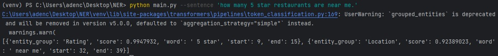

# How to run the python script:
1. Install all the required packages.
2. Download the trained model from: https://drive.google.com/file/d/12n1GsBpqrANuHgMEDc89jazjMmTPCVPr/view?usp=sharing
3. Unzip it into the same directory.
4. Run the following command:
   - `python main.py --sentence "your sentence here."`
5. Sample output shown as below:
